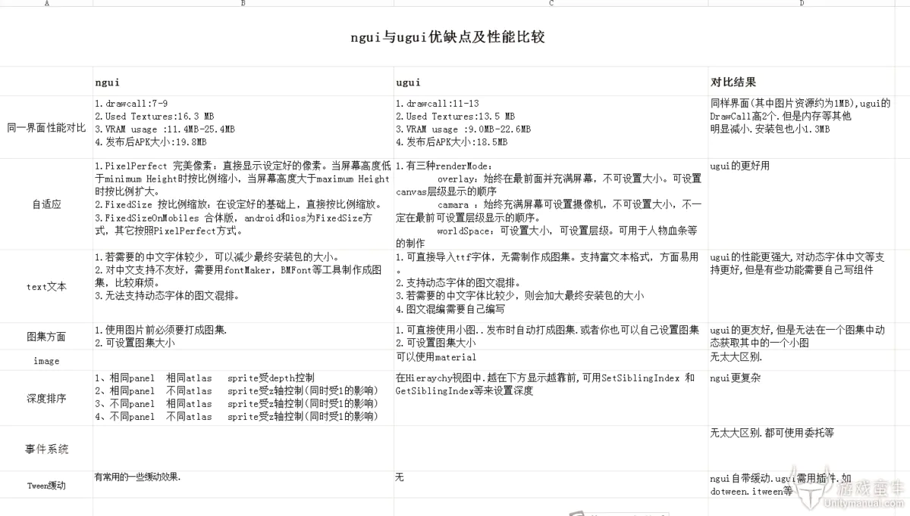
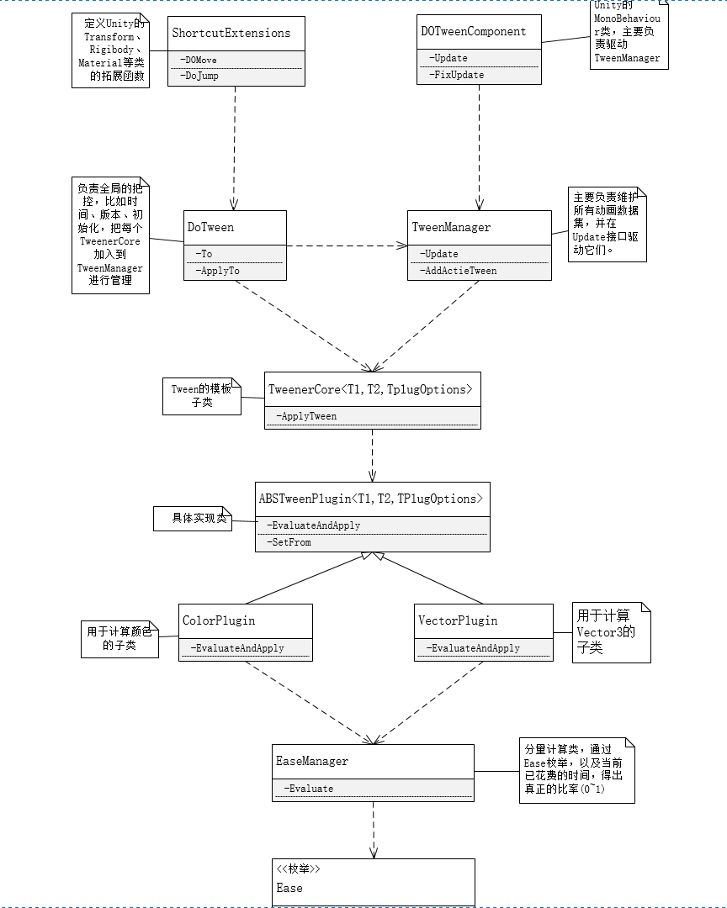
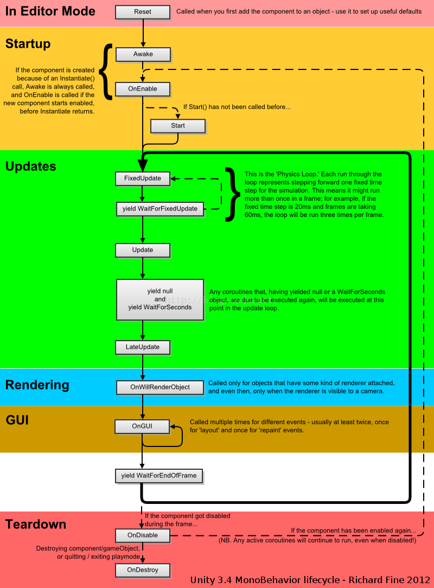

### Unity 协程和线程,进程的区别
- 其实很简单，首先需要理解进程和线程是怎么一回事：进程是Windows系统中的一个基本概念，他包含着运行一个程序所需要的基本资源。一个正在运行的应用程序在操作系统中被视为一个进程，进程可以包括一个或多个线程。　　
- 进程和线程的区别通过以上，一目了然。　　
- 再谈谈线程和协程的区别。一般应用一个应用程序只使用线程这一“资源”。
- 需要明确，Unity只使用了一个线程，但是，我们需要”同时做很多事“，那Unity作为单线程，该如何去做，协程，就来了，协程是一种”伪线程“。
协同程序（coroutine）.,即协作式程序，一系列互相依赖的协程间依次使用CPU，每次只有一个协程工作，而其他协成处于休眠状态。协程实际上是在一个线程中，只不过每个协程对CPU进行分时，协程可以访问和使用unity的所有方法和component。　　　　
- 同一时间只能执行某个协程，协程适合对某个任务进行分时处理。　　　　
- 控制代码在特定的时间执行。　　　　
- 协程不是线程，也不是异步执行，跟Update一样，在主线程中执行。　　　　
- 不用考虑同步和锁的问题。　　　　
- 协程是一个分部组件，遇到条件（yield return）会挂起,直到条件满足才会被唤起执行后面的语句。

### 本地坐标系 世界坐标系
- 世界坐标系：世界坐标是指物体在场景中的坐标，当某个物体没有父物体时，它的position即为世界坐标的position，rotation同理；本地坐标是物体相对于它的父物体的坐标而言，这个相对坐标是以父物体本身为坐标轴进行计算的，与世界坐标没有必然联系。而对于没有父物体的物体，可以认为不存在本地坐标这种说法。
- 本地坐标系：当某个物体有父物体时，它的inspector栏transform中的position实际是localposition，即本地坐标。
- 使用TransformPoint方法将本地坐标系转为世界坐标系

### Unity调整旋转
- 矩阵旋转：
    - 优点：旋转轴可以是任意向量
    - 缺点：旋转其实只需要知道一个向量+一个角度(共4个信息值)，但矩阵却用了16个元素(矩阵法消耗时间和内存)、
- 欧拉角旋转
    - 优点：容易理解，形象直观；表示更方便，只需要三个值(分别对应x、y、z轴的旋转角度)
    - 缺点：欧拉角这种方法是要按照一个固定的坐标轴的顺序旋转的，因此不同的顺序会造成不同结果；欧拉角旋转会造成万向锁现象，这种现象的发生就是由于上述固定的坐标轴旋转顺序造成的。理论上，欧拉角旋转可以靠这种顺序让一个物体旋转到任何一个想要的方向，但如果在旋转中不幸让某些坐标轴重合，就会发生万向锁现象，这时就会丢失一个方向上的旋转能力(两个旋转轴(环)重叠)，也就是说在这种状态下，我们无论怎么旋转(还是按照原先的旋转顺序)，都不可能得到某些想要的结果，除非打破原先的旋转顺序或者同时旋转三个轴。
    - 由于万向锁的存在，欧拉旋转无法实现球面平滑插值。
    - 万向锁的简单解决办法：构造一个不同的旋转层级顺序，但是万向锁总是会在某一个顺序发生，调整旋转顺序不是根本解决办法。（Unity使用的是Z-X-Y顺规，即旋转顺序为z轴、x轴、y轴，虽然某些情况下会出现万向锁，但是这种顺规出现万向锁的概率最小）
    - 万向锁解决办法：将欧拉角转换为四元数，对四元数进行Slerp插值，再将这一系列四元数转换为对应的欧拉角，然后作用于需要进行旋转的对象。这种做法缺点在于消耗内存，但是可以使物体任意旋转，灵活度高。
    - 使用欧拉旋转出现旋转路径偏移的根本原因：在万向锁情况下对欧拉角的插值不是线性的。(突变)
    - 静态欧拉角：其旋转轴使用的是静止不同的参考系。
    - 动态欧拉角：使用object本身的坐标系，因而会随着object旋转而旋转。(局部坐标系会随着对象的旋转而旋转)
- 四元数旋转
    - 优点：可以避免万向锁；只需要一个4维的四元数就可以执行绕任意过原点的向量的旋转，方便快捷，在某些实现下比旋转矩阵效率更高；而且四元数旋转可以提供平滑插值。
    - 缺点：比欧拉旋转稍微复杂了一点，因为多了一个维度，理解更困难，不直观。

### NGUI与UGUI
1. NGUI与UGUI的区别
UGUI是官方4.6以后推出的一套UI组件，相对于之前的GUI倒是改头换面了，可视化操作，便捷、省心。NGUI则是unity一直以来最强的UI插件（没有之一），甚至还是官方新UI的导师。
    1. ugui的ui根目录为canvas（画布），ngui则是uiroot。在命名上官方似乎更贴合想象力。
    2. 在屏幕自适应方面，ugui为render mode。ngui则为scaling style。
    3. anchor（锚点）的使用方式差不多，都是用来固定位置，在可视化方面，ugui的花瓣锚点真不太好调。
    4. ngui灵活性不是一般的高，随意创建一个sprite，加了boxcollider，它就可以是按钮、滑动条……
    5. ugui的sprite的切图功能真心不错。ngui使用图集不能直接拖拉（毕竟是三方插件）略不方便。
    6. ngui的tween动画功能很省心，无需额外定义代码，使用封装好的脚本就可以实现一些简单动画，叠加脚本甚至能实现相对复杂的动画效果。

总结：
- NGUI与UGUI的区别
- uGUI的Canvas 有世界坐标和屏幕坐标
- uGUI的Image可以使用material
- UGUI通过Mask来裁剪，而NGUI通过Panel的Clip
- NGUI的渲染前后顺序是通过Widget的Depth，而UGUI渲染顺序根据Hierarchy的顺序，越下面渲染在顶层.
- UGUI 不需要绑定Colliders，UI可以自动拦截事件
- UGUI的Anchor是相对父对象，没有提供高级选项，个人感觉uGUI的Anchor操作起来比NGUI更方便
- UGUI没有Atlas一说，使用Sprite Packer
- UGUI的Navigation在Scene中能可视化
- UGUI的事件需要实现事件系统的接口，但写起来也算简单

2. 各自的优缺点
    1. NGUI还保留着图集，需要进行图集的维护。而UGUI没有图集的概念，可以充分利用资源，避免重复资 源。
    2. UGUI出现了锚点的概念，更方便屏幕自适应。
    3. NGUI支持图文混排，UGUI暂未发现支持此功能。
    4. UGUI没有 UIWrap 来循环 scrollview 内容。
    5. UGUI暂时没有Tween组件。

3. 使用选择总结
UGUI由于是Unity原生支持的，所以使用上会更加的人性化。并且伴随着版本升级功能会越来越强，逐渐将成为主流ui方案。NGUI是UGUI出现之前的产物，通过MeshRenderer来实现类似CanvasRenderer的功能，概念上有点蹩脚。作为一个插件虽然已最大努力让UI开发工作变得简单，但相比能够让UnityEditor做出相应修改的UGUI（如RectTransform的出现），其易用性是没法比的。综合来说，新的项目建议使用UGUI，学习成本不高，工具流更有助于提高开发效率。

### UI事件渗透
http://www.xuanyusong.com/archives/4241

### DoTween
先来看一下我画的DoTween的类图结构：

只要明白上面类图中的结构，我认为就差不多搞懂了DoTween的大体实现方式了。首先在Unity中之所以可以使用例如：transform.DoMove(new vector3(1,1,1)，2)；这种的调用方式，是因为DoTween定义了大量与Transform、Rigibody、Material、Camera等相关的拓展函数，这些拓展函数就定义在了ShortcutExtensions类中。拓展函数真是个c#的伟大设计，由于它的存在，使用者可以像调用类的原生函数一样调用自定义函数，使用起来简洁、高效，还减少了入参的数量和相关的有效性判断，可谓是一举多得。在以后自己的项目中编写模块时也可使用此方法。

### 碰撞器和触发器的区别
- 碰撞器是触发器的载体，而触发器只是碰撞器身上的一个属性。
- 当Is Trigger=false时，碰撞器根据物理引擎引发碰撞，产生碰撞的效果，可以调用OnCollisionEnter/Stay/Exit函数；
- 当Is Trigger=true时，碰撞器被物理引擎所忽略，没有碰撞效果，可以调用OnTriggerEnter/Stay/Exit函数。
- 如果既要检测到物体的接触又不想让碰撞检测影响物体移动或要检测一个物件是否经过空间中的某个区域这时就可以用到触发器

### UGUI canvas的三种模式
【Unity3d游戏开发】浅谈UGUI中的Canvas以及三种画布渲染模式: https://www.cnblogs.com/msxh/p/6337338.html

### UnityMonoBehaivoir生命周期

MonoBehaviour是Unity中所有脚本的基类，如果你使用js的话，脚本会自动继承MonoBehaviour。如果使用C#的话，你需要显式继承MonoBehaviour。
在我们使用MonoBehaviour的时候，尤其需要注意的是它有哪些可重写函数，这些可重写函数会在游戏中发生某些事件的时候被调用。我们在Unity中最常用到的几个可重写函数是这几个：
- Awake：当一个脚本实例被载入时Awake被调用。我们大多在这个类中完成成员变量的初始化
- OnEnable：当对象变为可用或激活状态时此函数被调用。
- Start：仅在Update函数第一次被调用前调用。因为它是在Awake之后被调用的，我们可以把一些需要依赖Awake的变量放在Start里面初始化。 同时我们还大多在这个类中执行StartCoroutine进行一些协程的触发。要注意在用C#写脚本时，必须使用StartCoroutine开始一个协程，但是如果使用的是JavaScript，则不需要这么做。
- Update：当MonoBehaviour启用时，其Update在每一帧被调用。
- FixedUpdate：当MonoBehaviour启用时，其 FixedUpdate 在每一固定帧被调用。
- LateUpdat 方法 :是在所有Update函数调用后被调用。这可用于调整脚本执行顺序。例如:当物体在Update里移动时，跟随物体的相机可以在LateUpdate里实现
- OnGUI 方法:  渲染和处理GUI事件时调用 这里不是 没帧都调用哦
- OnDisable：当对象变为不可用或非激活状态时此函数被调用。
- OnDestroy：当MonoBehaviour将被销毁时，这个函数被调用。

### Unity GC
【Unity3d游戏开发】浅谈Unity中的GC以及优化:https://blog.csdn.net/worisaa/article/details/64121436

 Unity GC垃圾回收 : https://blog.csdn.net/wangjiangrong/article/details/89011349

### 10000个monobehavior，每个各自执行update，和放到一个update里执行，哪个效率更高？为什么？
Unity3d 10000 Update() calls 性能优化 https://blog.csdn.net/huutu/article/details/50522585

### 为什么instantiate会耗性能？
第一次执行GameObject.Instantiate的时候有明显卡顿，该怎么解决？
https://answer.uwa4d.com/question/58f376cd691df3f25d576cf1/undefined
Unity3d性能优化（CPU）
https://www.jianshu.com/p/df31fec9b4b8

### AssestBundle基础:
https://blog.csdn.net/a834595603/article/details/91346559

### AB包的压缩格式有哪些？你知道哪些压缩算法？
Unity3D:资源包的压缩(Asset Bundle Compression)
https://blog.csdn.net/zgl159040290/article/details/52806507

### Uielement
一个新的用于UnityEditor的UI框架,实现类似于Web前端
Unity 2019.1的UIElements功能介绍
https://www.linecg.com/news_8740.html

### 动态合批静态合拼
https://www.cnblogs.com/skandya/p/4905145.html

