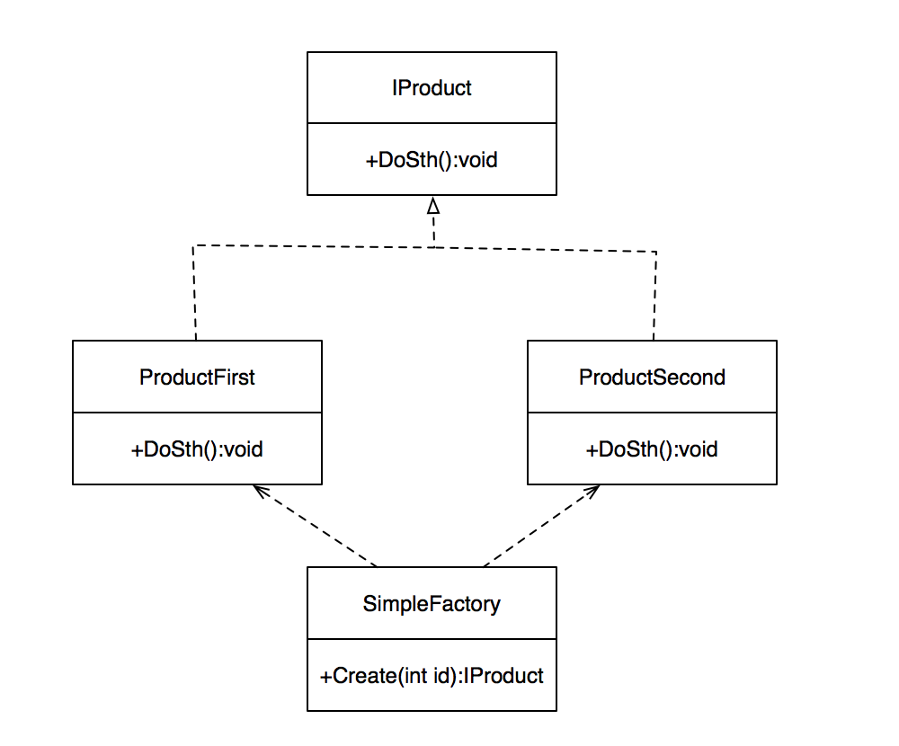
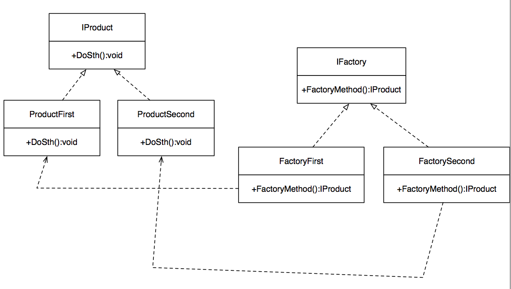
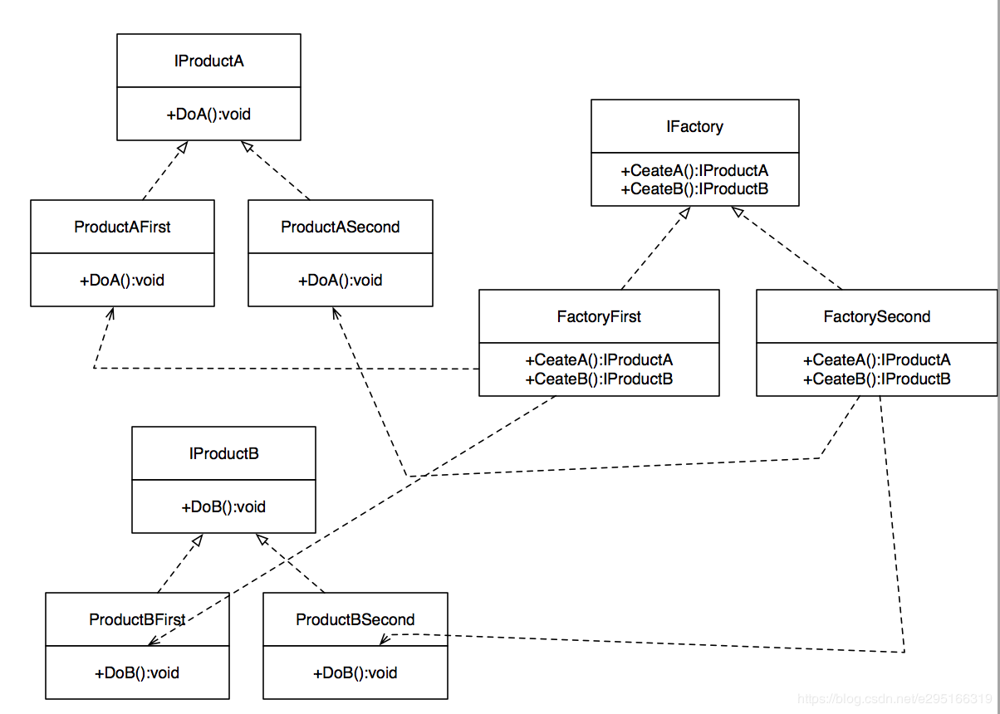

### 七大设计模式
- 单一职责原则
    - 这个原则强调的是“当设计封装一个类时，该类应该只负责一件事”
    说起来好像很简单，实际上对功能的划分通常也是开发者最头疼的一件事。
    解决方案就是对类进行不断的重构，将部分功能抽成新的类，再利用组合的方式将新的类加
    到原来的类中，慢慢的就会变成一个类只负责单一功能的实现。    
- 开闭原则
    - 这个原则强调的是“一个类应该对扩展开放，对修改关闭”
    具体来说，对于已经完成测试或者上线运营的功能，我们不应该再修改这个类的任何接口或者实现内容，但是应该对功能的增加保持开放。
    为了满足这个原则的要求，我们需要将“方法”上升到接口，将“实现”下放到子类中，这样当新增一个需求时，我们重新实现一个子类继承自接口或者旧的子类，然后在新的子类中新增功能，这样就保证了旧的功能没有发生变化（对修改关闭），同时新增了功能（对扩展开放）。
- 里氏替换原则
    - 这里强调的是“子类必须能够替换父类”
    关于这个概念，一般书中介绍的都比较抽象，也曾将困扰了许多人。笔者在此结合多方资料，说一下自己的理解
    首先里氏替换原则是继承复用的基础，反映了父类与子类之间的关系。
    通俗的讲有父类的地方，全部替换成子类，不影响程序的运行，这样就满足里氏替换原则。
    那什么样的子类在替换父类时，不会影响程序运行呢？
    这种子类可以扩展父类的功能，但不能修改父类的原有功能。这也是对单一职责原则的补充——对扩展开放，对修改关闭。
    如果违背了里氏替换原则，会让程序出错的概率大大提升
    举个栗子🌰🌰🌰
    我们定义了一个父类——鸟，并且带有一个方法可以返回鸟的飞行高度。再定义两个子类：麻雀、企鹅，并且企鹅重写了返回飞行高度的方法，使得返回值为0。当外部需要获取所有鸟类的飞行高度，并作为除数的分母使用，我们都知道0不可以作为分母，这时程序便出错了。
    这个栗子便出现了“子类修改父类原有功能”的禁忌，违反了里氏替换原则，也就是不能采用继承结构，要重新设计他们之间的关系。
- 依赖倒置原则
    - 这个原则包含了两个主题
    高层模块不能依赖于底层模块，两者都应该依赖于抽象概念
    抽象接口不应该依赖于实现，而实现应该依赖于抽象接口
    这里的抽象概念，我理解为接口，所以这是在告诉我们，要面向接口编程，不要面向实现方式编程。
    那为什么我们要面向接口编程呢，这里我举一个实际生活中的栗子🌰🌰🌰
    我们的电脑就是高层模块，各种硬件设备就是底层模块，我们每增加一个硬件设备（底层模块），电脑（高层模块）就需要设计一个新的接口来兼容设备，这样便是高层模块依赖于底层模块，并且这并没有满足开闭原则，因为每次新增设备，都要对电脑进行修改。但是如果电脑定义了一个通用接口，每个硬件设备都遵循了接口协议，大家都可以插到同一个接口上，那电脑便不再依赖硬件设备了，并且两者现在都只需要跟中间层接口沟通就好，这也就是两者都依赖于抽象概念。
    所以从这里我们能看出，依赖导致原则也是实现开闭原则的重要途径之一，他的目的是通过面向接口编程，来降低类与类之间的耦合。
- 接口隔离原则
    - 这里强调的是“客户端不应该被迫使用他们用不到的接口方法”
    其实就是要求我们对各个类，建立他们专用的接口，而不要试图去建立一个庞大的接口提供给所有需要他的类去调用它。
- 最少知识原则
    - 定义上说，一个类应该对其他类拥有最少的知识
    翻译成人话就是，如果两个类之间无需直接通信，那就不要互相调用，交给第三方转发就好了
    举个栗子🌰🌰🌰
    公司老板不需要跟公司每个员工都直接交流，他只需要跟项目经理交流就好，由项目经理负责传达老板的指示，这样老板就拥有了对其他员工最少的知识，解除了对每个员工的依赖（耦合），现在他只依赖于项目经理。至于基层人员，当然可以说开就开喽。
    但是在使用迪米特法则的时候需要反复权衡，如果使用不当，会产生大量中介类，使项目结构变的混乱。
- 合成复用原则
    - 其实合成复用原则讲的就是如果可以用组合解决问题，就不用继承。
    也就是组合优于继承。
    为什么组合会优于继承呢？
    首先，如果使用了继承，子类重写了父类方法，就会违背里氏替换原则，会让程序增加出错的可能。这里合成复用原则和里氏替换原则又是相辅相成的。
    其次，使用继承，子类会依赖于父类的实现，这不利于类的扩展和实现。
    最后，C#是无法使用多重继承的，使用组合的方式会比层层继承来的明白，利于项目的维护。
    实现这个原则的方式也很简单，是通过将已有的对象纳入新对象中，作为新对象的成员对象来实现的，新对象可以调用已有对象的功能，从而达到复用。
- 总结
    - 设计模式就是学习面向对象程序设计的最佳模版，它在我看来最终的目的都是通过解耦来提升程序的稳定性和扩展性，使用的手段包括提供中间层（接口）、划分职责、约定限制等。
    而我们在游戏开发中，面临最多的问题在前期可能是大量的需求更改，中期要求敏捷开发，后期需要提供稳定的游戏框架支撑千万级用户，这都需要用到设计模式。
    此篇是对设计模式笔记的一个开头，后面会总结常见的设计模式与游戏开发结合的案例，并且会提供Unity版本的实现方式。

### 工厂模式
##### 简单工厂模式
讲工厂，首先得从简单工厂说起。
简单工厂模式的目的是用来创建不同类型的对象。需要指出的是它并不是GOF的23种模式之一。

**结构:**



**实现:**
``` C#
public interface IProduct {
    void DoSth();
}

public class ProductFirst : IProduct {
    public virtual void DoSth(){
        Debug.Log("ProductFirst DoSth");
    }
}
public class ProductSecond : IProduct {
    public virtual void DoSth(){
        Debug.Log("ProductFirst DoSth");
    }
}

public class SimpleFactory {
    public static IProduct Create(int id){
        switch(id){
            case 1:
                return new ProductFirst();
                break;
            case 2:
                return new ProductSecond();
                break;
            default:
                return null;
                break;
        }
    }
}
```
简单工厂模式的Create()方法里，可以添加各种逻辑，用于创建对应的实例。unity3d中很多时候创建的是游戏中的物件，这时简单工厂模式中创建者的参数可以对应prefab的名字。

**优点**
简单，可以取名叫『2分钟内可以学会的设计模式』
实现逻辑清晰，根据不同的创建参数创建对应实例。
名为简单工厂方法，看起来果然是很简单，对不对？那么，本着”simple is best”的逻辑，是不是我们应该大力推广简单工厂模式呢？
答案是「No」。简单工厂模式有其固有的缺陷，在使用时需要严格限定其范围。

**缺陷**
让我们首先考虑一个问题。此处使用的Create()方法，直接决定我们产生实例的逻辑。
那么，现在问题来了。
假如我们不希望通过判断参数是1还是2，来进行不同实例的生成呢？
显然，一旦我们需要新的逻辑来产生实例的话，我们就不得不对代码进行修改。
当然，从理论上，我们也可以发现简单工厂模式的一些问题。
Open-closed原则，即是对扩展开放，对修改封闭。使用简单工厂模式时，很多时候违背了这一原则。同时，由于产生不同实例的方法在可预见的将来有可能会变得很复杂，是否满足单一职责这一点也值得商榷。
那么，我们有办法解决这个问题吗？嗯，接下来就是抽象程度更高的方法出场了。


##### 工厂方法

工厂方法与简单工厂最大的区别，在于工厂方法将工厂进行了抽象，将实现逻辑延迟到工厂的子类。

**结构**



**实现**
为了让我们例子更贴近生产环境，在这里采用一个更加实际的问题。
场景当中有两个物体，我们希望其中一个向左走，一个向右走。
我们用工厂方法来生成这两个向左向右的控制器，并添加到对应的物体上。当然，事实上这个例子依然很单薄，实际面对这个问题我们肯定不会这样实现就是了。
上代码

 IWalker
``` C#
public interface IWalker {
    void Walk(Transform target);
}
```
LeftWalker
``` C#
public class LeftWalker : MonoBehaviour, IWalker {
    Transform _target;
    public virtual void Walk(Transform target){
        _target = target;
        StartCoroutine(WalkLeft());
    }

    IEnumerator WalkLeft(){
        while(true){
            _target.Translate(Vector3.left * Time.deltaTime);
            Debug.Log("WalkLeft " + _target.localPosition);
            yield return new WaitForFixedUpdate();
        }
    }
}
```

RightWalker
``` C#
public class RightWalker : MonoBehaviour, IWalker  {
    Transform _target;
    public virtual void Walk(Transform target){
        _target = target;
        StartCoroutine(WalkRight());
    }

    IEnumerator WalkRight(){
        while(true){
            _target.Translate(Vector3.right * Time.deltaTime);
            Debug.Log("WalkRight " + _target.localPosition);
            yield return new WaitForFixedUpdate();
        }
    }
}
```

IWalkerFactory
``` C#
public interface IWalkerFactory {
    IWalker Create();
}
```

LeftWalkerFactory
``` C#
public class LeftWalkerFactory : IWalkerFactory {
    public virtual IWalker Create(){
        return new GameObject().AddComponent<LeftWalker>();
    }
}
```

RightWalkerFactory
``` C#
public class RightWalkerFactory : IWalkerFactory{
    public virtual IWalker Create(){
        return new GameObject().AddComponent<RightWalker>();
    }
}
```

**优点**
工厂方法比简单工厂多了一层抽象。
由于抽象工厂层的存在，当我们需要修改一个实现的时候，我们不需要修改工厂的角色，只需要修改实现的子类就可以完成这个工作。
同样，当我们需要增加一个新产品的时候，我们也不需要修改工厂的角色，只需要增加一个新的实现工厂来完成实现就可以了。
显然，这样更易于扩展，并且，整体代码的层级结构更加分明，创建实际产品的职责更加单一。
此外，很显然客户在定义工厂角色的时候不需要知道实现子类。只有当实际需要创建的时候，才动态指定子类。这同样带来了代码的稳定性和最小可知性。

**缺陷**
显然，使用工厂方法的代码量是多于简单工厂的。
同时，每增加一个新的产品，就会增加一个新的工厂类，代码的复杂程度自然也随之上升了。我们会为此创建很多的工厂。

##### 抽象工厂
抽象工厂和工厂方法实际上是很像的，不过抽象工厂增加了另外一个概念，就是产品族。也就是说，一个工厂可以生产一系列的产品，这些产品的定义都在工厂当中。

**结构**



**实现**
ok。这个模式老实说意义不是很大。直接上代码吧，就不加注释了
``` C#
public interface IActorFactory  {
    IFlyer CreateFlyer(GameObject go);
    IWalker CreateWalker(GameObject go);
}
 
public interface IFlyer {
    void Fly(Transform target);
}
 
public class LeftActorFactory : IActorFactory {
    public virtual IFlyer CreateFlyer(GameObject go){
        return go.AddComponent<LeftFlyer>();
    }
 
    public virtual IWalker CreateWalker(GameObject go){
        return go.AddComponent<LeftWalker>();
    }
 
}
 
public class RightActorFactory : IActorFactory{
    public virtual IFlyer CreateFlyer(GameObject go){
        return go.AddComponent<RightFlyer>();
    }
 
    public virtual IWalker CreateWalker(GameObject go){
        return go.AddComponent<RightWalker>();
    }
 
}
```
**优点**
当我们需要增加一个产品族的时候，我们只需要增加一个工厂，实现其中所有产品的实现就行了。 
抽象工厂的设计，使得我们可以很容易的增加一个产品系列。

**缺点**
抽象工厂当中，产品族的定义使得子类必须去实现所有的产品生产。 
因此，抽象工厂并不适合于横向扩展，即需要增加产品的情况。 
一旦需要增加产品，那么我们甚至需要去修改抽象的基类。这是比较违反开闭原则，不太符合面向对象设计的做法。

**总结**
从简单工厂到工厂方法再到抽象工厂。我们可以看到，抽象的程度越来越高，能够解决的问题也越来越复杂。 
不过，个人的经验而言，一般在unity3d当中也顶多用到工厂方法而已。抽象工厂事实上并不是一个很灵活的解决方案。 
而且，对于unity3d中组件的创建，事实上是有一些非常灵活的解决方案可以处理的。实体与组件系统，相当适合于组件的构建，比起工厂方法来说更加灵活和易于扩展。 
以后有时间的时候再对此进行说明。


