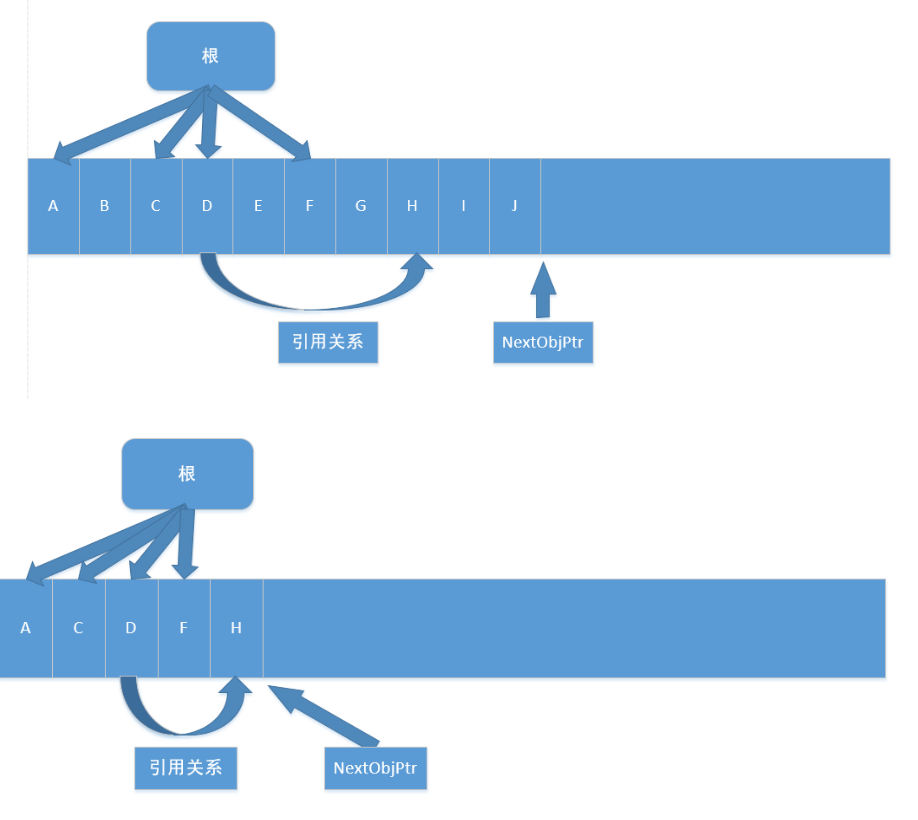
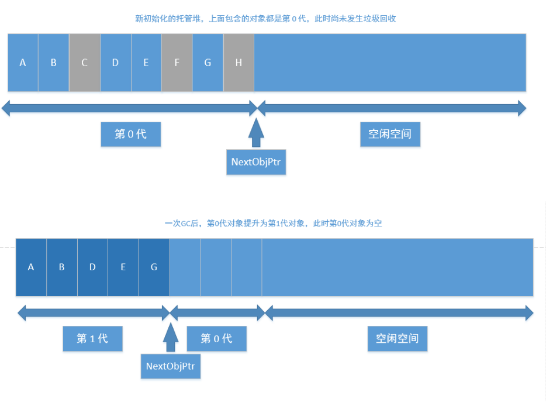

### 值类型和引用类型的区别
- 速度上的区别:值类型存取速度快，引用类型存取速度慢。
- 用途上的区别:值类型表示实际数据，引用类型表示指向存储在内存中的数据的指针或引用。
- 来源上的区别:值类型继承自System.ValueType，引用类型继承自System.Object
- 位置上的区别:值类型的数据存储在内存的栈中，引用类型的数据存储在内存的堆中，而内存单元中只存放堆中对象的地址。
- 类型上的区别:值类型的变量直接存放实际的数据，而引用类型的变量存放的则是数据的地址，即对象的引用。
- 保存位置上的区别:值类型变量直接把变量的值保存在堆栈中，引用类型的变量把实际数据的地址保存在堆栈中，而实际数据则保存在堆中。

### 拆箱装箱
- 装箱 就是把“值类型”转换成“引用类型”(Object)
- 拆箱 就是把“引用类型”转换成“值类型”

### in out ref
- in 关键字通过引用传递参数。 它让形参成为实参的别名，这必须是变量。 换而言之，对形参执行的任何操作都是对实参执行的。 它类似于 ref 或 out 关键字，不同之处在于 in 参数无法通过调用的方法进行修改。
- out 关键字通过引用传递参数。 它让形参成为实参的别名，这必须是变量。 换而言之，对形参执行的任何操作都是对实参执行的。 它与 ref 关键字相似，只不过 ref 要求在传递之前初始化变量。 它也类似于 in 关键字，只不过 in 不允许通过调用方法来修改参数值。 若要使用 out 参数，方法定义和调用方法均必须显式使用 out 关键字。
- ref该种类型的参数传递变量地址给方法（引用传递），传递前变量必须初始化。 该类型与out型的区别在与： 1）.ref型传递变量前，变量必须初始化，否则编译器会报错,而out型则不需要初始化 2）.ref型传递变量，数值可以传入方法中，而out型无法将数据传入方法中。换而言之，ref型有进有出，out型只出不进。

### C#字符串复制
- 复制是通过Copy和CopyTo来实现的。string.Copy(要复制的字符串);CopyTo(要复制字符的起始位置(从第几个字符开始往后复制（不包括第几个字符）)，目标字符数组，目标数组中的开始存放位置，要复制的字符个数);


### 介绍const？const修饰成员函数时放在哪？
- 修饰不变常量，在编译的时候就需要有确定的值，只能用于数值和字符串，或者引用类型只能为null，struct也不能用const标记。const可以修饰class的字段或者局部变量，不能修饰属性。而readonly仅仅用于修饰class的字段，不能修饰属性。const是属于类级别而不是实例对象级别，不能跟static一起使用。而readonly既可以是类级别也可以是实例级别，它可以与static一起使用。
- readonly是只读的意思，表示不能进行写操作。最重要的是它在程序运行时才会去求值。它可以是任意类型，当然可以是object，数组，struct，它必须在构造函数或者初始化器中初始化，初始化完成之后不能被修改。通常可以定义一个readonly值为DateTime的常量。而const却无法指定为DateTime类型。
- 只有C#内置类型（int,double,long等）可以声明为const;结果、类和数组不能声明为const。
- readonly 是在字段上使用的修饰符，直接以类名.字段访问。
- const 必须在申明中初始化。之后不能再修改。
- readonly可以在申明中初始化，也可以在构造函数中初始化，其它情况不能修改。

### 函数可以返回引用吗？为什么？
- 引用就是变量的别名，操作一个变量的引用也就相当于操作变量本身，这一点跟指针很类似，但是操作引用不用像操作指针一样，利用取地址符号，很不方便。而操作引用的话，则跟操作普通变量一样，所以C++之中更加鼓励使用引用。
- C语言之中大量利用指针作为形参或者函数返回值，这是由于值拷贝会有很大的消耗（比如传入传出一个大的结构体）。所以在C++之中使用引用作为函数参数和返回值的目的和使用指针是一样的。而且形式上更加直观，所以C++提倡使用引用。
- 使用引用当作函数参数和返回值，效率更高。
- 函数返回的对象引用，必须在调用函数前就已经存在，不允许返回局部变量的引用！
- 当不希望返回的对象被修改的时候，可以添加const。


### C# GC
**基本概念**

- CLR: Common Language Runtime, 公共语言运行时，是一种可以支持多种语言的运行时，其基本的核心功能包含:
    - 内存管理
    - 程序集加载和卸载
    - 类型安全
    - 异常处理
    - 线程同步


- 托管模块的基本组成:
    - PE32/PE32+(64位)
    - CLR头
    - 元数据
    - IL代码(托管代码)
    
- 引用类型和值类型
    - 这部分略过，基本都有相关的认识，本质是看其分配的内存位于内存堆上还是栈上。
    - 每个进程会分配一个对应的进程堆，这就是我们常说的程序内存申请区域，不同进程是不会有交叉的。在堆上还是在栈上进行内存分配，是没有速度差异的，都很快。
    
- 垃圾回收器(Garbage Collector)
    - 在CLR中的自动内存管理，就会使用垃圾回收器来执行内存管理，其会定时执行，或者在申请内存分配是发现内存不足时触发执行，也可以手动触发执行(System.GC.Collect)
    - 垃圾回收的几种基本算法
        - 标记清除算法(Mark-Sweep)关键点是，清除后，并不会执行内存的压缩
        - 复制算法(Copying) 内存等额划分，每次执行垃圾回收后，拷贝不被回收的内存到没有被使用的内存块，自带内存压缩，弊端是内存浪费大(每次只能使用部分，预留部分给拷贝使用)
        - 标记整理算法(Mark-Compact)关键点，清除后，会执行内存压缩，不会有内存碎片
        - 分代收集算法(Generational Collection)对内存对象进行分代标记，避免全量垃圾回收带来的性能消耗。下文会详细讲解。

**垃圾回收模型**

- 垃圾回收的目的
    - 缘由： 内存是有限的，为了避免内存溢出，需要清理无效内存
- 触发时机
    - 申请分配内存时内存不足(本身不足或者内存碎片过多没有足够大小的内存片)
    - 强制调用System.GC.Collect
    - CLR卸载应用程序域(AppDomain)
    - CLR正在关闭(后面2种在进程运行时不会触发)
- 垃圾回收的流程
    - GC准备阶段 暂停进程中的所有线程，避免线程在CLR检测根期间访问堆内存
    - GC的标记阶段 首先，会默认托管堆上所有的对象都是垃圾(可回收对象)，然后开始遍历根对象并构建一个由所有和根对象之间有引用关系的对象构成的对象图，然后GC会挨个遍历根对象和其引用对象，如果根对象没有任何引用对象(null)GC会忽略该根对象。对于含有引用对象的根对象以及其引用对象，GC将其纳入对象图中，如果发现已经处于对象图中，则换一个路径遍历，避免无限循环。PS： 所有的全局和静态对象指针是应用程序的根对象。
    - 垃圾回收阶段 完成遍历操作后，对于没有被纳入对象图中的对象，执行清理操作
    - 碎片整理阶段 如果垃圾回收算法包含这个阶段，则会对剩下的保留的对象进行一次内存整理，重新归类到堆内存中，相应的引用地址也会对应的整理，避免内存碎片的产生。
    


- 分代垃圾回收的过程
    - 分代的基本设计思路:
        - 对象越新，生命周期越短，反之也成立
        - 回收托管堆的一部分，性能和速度由于回收整个托管堆
    - 基本的分代: 0/1/2：
        - 0代: 从未被标记为回收的新分配对象
        - 1代: 上一次垃圾回收中没有被回收的对象
        - 2代: 在一次以上的垃圾回收后任然未被回收的对象
    - 低一代的GC触发，移动到高一代后，未必会触发高一代的GC，只有高一代的内存不足时才会触发高一代的GC
    - 不同代的自动GC频率是可以设置的，一般0:1:2的频率为100：10：1

- 操作图解释分代的过程:




-  非托管对象的回收
    - 对于非托管对象的管理，不受CLR的自动内存管理操作，这部分需要借鉴CLR的自动管理或者手动执行内存回收，这就是两种非托管对象的管理方式: Finalize和Dispose
    - 非托管资源: 原始的操作系统文件句柄，原始的非托管数据库连接，非托管内存或资源

- Finalize
    - System.Object定义了Finalize()虚方法，不能用override重写，其写法类似c++的析构函数:
``` C#
class Finalization{
    ~Finalization()
    {
        //这里的代码会进入Finalize方法
        Console.WriteLine("Enter Finalize()");
    }
}
```

- 转换的IL:

    
    - 基类方法放入到Finally中，其本质还是交给GC进行处理，只是其执行的时间不确定，是在GC完后在某个时间点触发执行Finalize方法，使用这个方法的唯一好处就是: 非托管资源是必然会被释放的。


- IDisposable
    - 继承了该接口，则需要实现Disposable接口，需要手动调用，这就确保了回收的及时性，对应的问题是如果不显示调用Dispose方法，则这部分非托管资源是不会被回收的。
    - c#中的using关键字，转换成IL语句，就是内部实现了IDispoable方法，最终的try/finally中，会在finally中调用dispose方法。

- Unity中的C# GC
    - 目前unity2018.4还是 Boehm–Demers–Weiser garbage collector， unity2019.1 中已经开始引入: Incremental Garbage Collection增量式垃圾回收功能,
    - 相关链接: https://www.gamefromscratch.com/post/2018/11/27/unity-add-incremental-garbage-collection-in-20191.aspx


### Lua GC

**基本数据结构**
lua的基本数据结构: union + type
``` lua
typedef union Value{
    GCObject* gc;   //gc object
    void* p;       // light userdata
    int b;         // booleans
    lua_CFunction f; // light c functions
    lua_Integer i;   //integer number 5.1为double，5.3为long long 8个字节
    lua_Number n;   // double number 5.3 为double 8个字节
} Value;

struct lua_Value{
    Value value_;
    int tt_;
} TValue;
```
对于所有的需要被GC的对象，都会放在GCObject组成的链表中


**GC算法和流程**

1.双色标记清除算法
在Lua5.0中的GC，是一次性不可被打断的操作，执行的算法是Mark-and-sweep算法，在执行GC操作的时候，会设置2种颜色，黑色和白色，然后执行gc的流程，大体的伪代码流程如下:


``` c
每个新创建的对象为白色

//初始化阶段
遍历root链表中的对象，并将其加入到对象链表中    

//标记阶段   
当前对象链表中还有未被扫描的元素:    
    从中取出对象并将其标记为黑色   
    遍历这个对象关联的其他所有对象: 
        标记为黑色
        
//回收阶段
遍历所有对象:   
    如果为白色:   
        这些对象没有被引用，则执行回收
    否则: 
        这些对象仍然被引用，需要保留
```
整个过程是不能被打断的，这是为了避免一种情况：
如果可以被打断，在GC的过程中新创建一个对象
那么如果标记为白色，此时处于回收阶段，那么这个对象没有被扫描就会被回收；
如果标记为黑色，此时处于回收阶段，那么这个对象没有被扫描就会被保留
两种情况都不适合，所以只有让整个过程不可被打断，带来的问题就是造成gc的时候卡顿

**三色标记清除算法**
虽然是三色，本质是四色，颜色分为三种:
- 白色: 当前对象为待访问状态，表示对象还未被gc标记过，也就是对象创建的初始状态； 同理，如果在gc完成后，仍然为白色，则说明当前对象没有被引用，则可以被清除回收
- 灰色: 当前对象为待扫描状态，当前对象已经被扫描过，但是其引用的其他对象没有被扫描
- 黑色: 当前对象已经扫描过，并且其引用的其他对象也被扫描过

其流程伪代码:
``` c
每个新创建的对象为白色

//初始化阶段   
遍历root阶段中引用的对象，从白色设置为灰色，并放入到灰色节点列表中   

//标记阶段    
当灰色链表中还有未被扫描的元素:    
    从中去除一个对象并将其标记为黑色   
    遍历这个对象关联的其他所有对象:   
        如果是白色:
            标记为灰色，并加入灰色链表中   
            
//回收阶段  
遍历所有对象:   
    如果为白色: 
        这些对象没有被引用，需要被回收
    否则:
        重新加入对象链表中等待下次gc   
整个标记过程是可以被打断的，被打断后回来只需要接着执行标记过程即可，回收阶段是不可被打断的。
```
如何解决在标记阶段之后创建的对象为白色的问题?
分裂白色为两种白色，一种为当前白色 currentwhite， 一种为非当前白色 otherwhite，新创建的对象都为otherwhite，则在执行回收的时候，如果为otherwhite则不执行回收操作，等待下次gc的时候，会执行白色的轮换，则新创建的对象会进入下一轮gc。

**lua gc的一些关键点**
1.初始化阶段的操作原理
以前我一直理解这个root就是将gcobject的链表进行转换到灰色链表中，其实并不是，而是去对当前虚拟机中的mainthread表, G表， registry表进行操作，其函数为:
``` c
static void markroot(lua_State * L)
{
    global_State *g = G(L);
    g->gray = NULL;
    g->grayagain = NULL;
    g->weak = NULL;
    //标记几个入口
    markobject(g, g->mainthread);
    markvalue(g, gt(g->mainthread));
    markvalue(g, registry(L));
    markmt(g);
    g->gcstate = GCSpropagte;
}
```
markobject/markvalue都是将对象从白色标记为灰色，所以这里面还有效的数据，就会最终进行扫描标记，如果最终不是白色，则会被保留，而执行回收操作的时候，是对gclist进行操作的，只要是currentwhite，那么就是可以被回收的。

2.对于中途创建的对象的颜色处理
这儿会分为两种，前向操作和后退操作:
- 前向操作: 新创建对象为白色，被一个黑色对象引用，则将当前新创建对象标记为灰色
- 后退操作: 新创建对象为白色，被黑色对象引用，该黑色对象退回到灰色，塞入到grayagain表中，后续一次性扫描处理

对大部分数据，都是前向操作，对于table类型数据，则如果其新创建对象，该table会回退到灰色塞入到grayagain表中。
本质没区别，主要是table属于频繁操作的对象，如果反复将table中新创建的对象都设置成灰色，则灰色链表会容易变得很大，所以为了提高性能，就将table塞入到grayagain表中，后续一次性处理即可。

### Lua 元表

菜鸟教程:https://www.runoob.com/lua/lua-metatables.html

lua的元表以及多继承:https://www.jianshu.com/p/3eaa69a6d0a2
